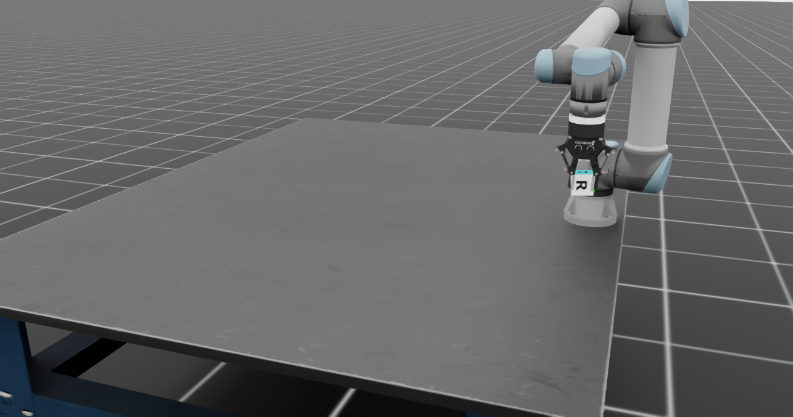

# UR5 Isaac Lab


[](https://docs.isaacsim.omniverse.nvidia.com/latest/index.html)
[](https://isaac-sim.github.io/IsaacLab/main/index.html)
[](https://docs.python.org/3/whatsnew/3.10.html)
[](https://releases.ubuntu.com/22.04/)
[](https://www.microsoft.com/en-us/)
[](https://opensource.org/license/apache-2-0)


This repository contains the implementation of the UR5 robot with the gripper robotiq 2f 85 in Isaac lab. It contains the simulated of the robot and examples on how to interact with it inside Isaac Lab enviroment. Also is included the implementation of diferent RL algorithms. 

## Requirements

- Conda environment with Python 3.10
- Isaac Lab installed (see [Isaac Lab installation](https://isaac-sim.github.io/IsaacLab/main/source/setup/installation/pip_installation.html))

## How to Run the Code

1. **Clone the repository:**
    ```bash
    git clone https://github.com/inaki1111/UR5_IsaacLab.git
    ```


2. **Access the repository:**
    ```bash
    cd UR5_IsaacLab
    ```

3. **Activate the conda environment:**
    ```bash
    conda activate isaacsim
    ```

4. **install de python package**

    ```bash
    cd source/ur5_isaaclab/
    ```
    ```bash
    pip install -e .
    ```

## Examples

This respository includes some examples on how to manipulate the robot inside of the simulation, as well as example of how to add different sensors and objetcs. 
[Examples](scripts/examples/)


# Reinforcement learning enviroments

This respository contains two working enviroment for the UR5 robot. You can find the code in [Tasks](source/ur5_isaaclab/ur5_isaaclab/tasks/manager_based)

8. **To train the reinforcement learning lift cube enviroment**
    ```bash
    python scripts/rsl_rl/train.py --task=Isaac-Lift-Cube-UR5-v0 --headless
    ```

9. **To play the reinforcement learning lift cube enviroment**
    ```bash
    python scripts/rsl_rl/play.py --task=Isaac-Lift-Cube-UR5-v0 --num_envs=1
    ```

10. **To play in livestream mode**
    ```bash
    python scripts/rsl_rl/play.py --task=Isaac-Lift-Cube-UR5-v0 --num_envs=1 --headless --livestream 2
    ```
11. **To train the reinforcement learning dynamic lift cube enviroment**
    ```bash
    python scripts/rsl_rl/train.py --task=Isaac-Lift-Cube-UR5-Moving-v0 --headless
    ```
