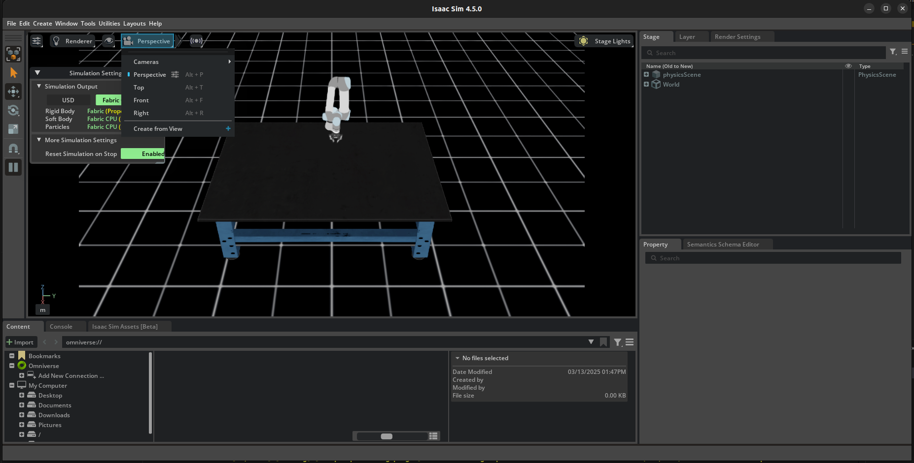
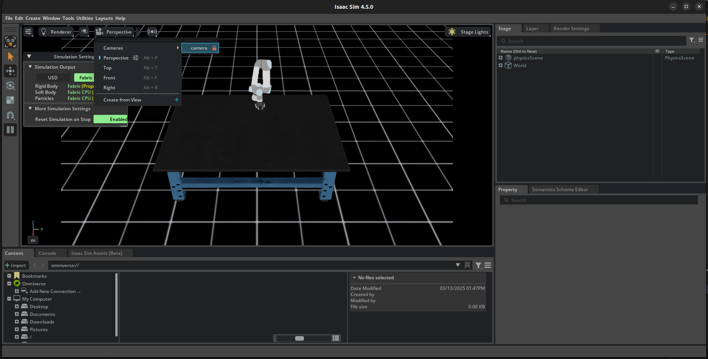

# Examples 


## Test Differential controller

    Test of the Differential IK Controller given by the example in isaac lab with the UR5
    ```bash
    python diff_ik.py --enable_cameras
    ```

6. **Watch the robot camera**
    
    

7. **To run the cube**
    ```bash
    python scripts/examples/grab_cube.py

    ```